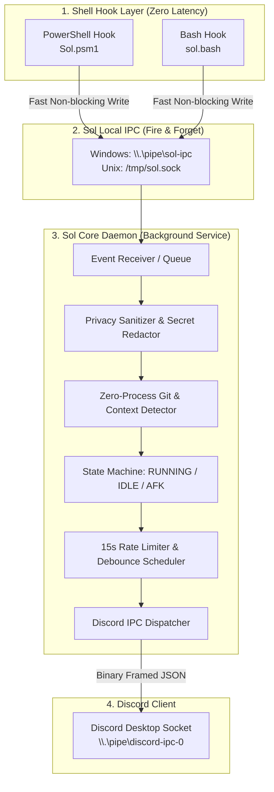
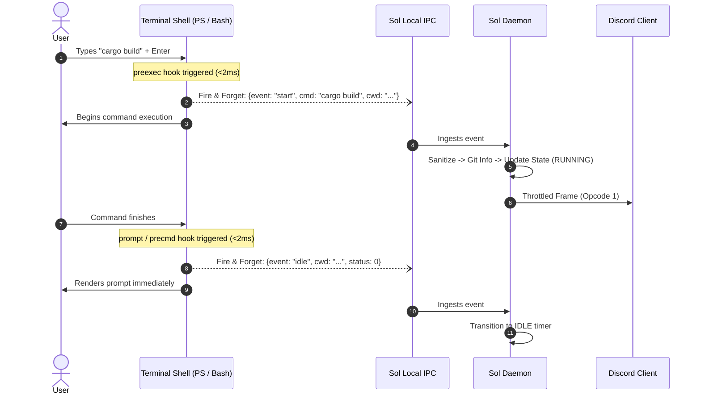
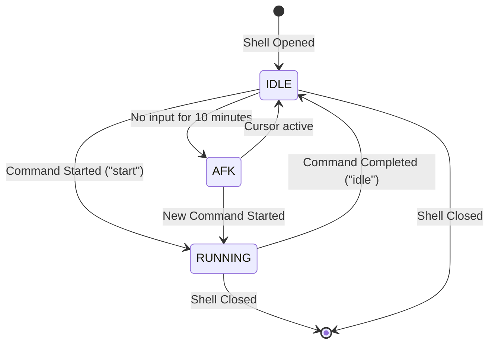

# Sol - Technical Architecture & Knowledge Base

> **Version:** 1.0.0  
> **Status:** Active / Living Specification  
> **Target Platforms:** Windows 10/11, macOS, Linux  
> **Target Shells:** PowerShell 5.1/7+, Bash 4+, (Zsh/Fish roadmap)

---

## 1. Executive Summary & Architectural Overview

The primary challenge of building a Discord Rich Presence integration for command-line shells is **the tension between latency and protocol overhead**:
- Discord Rich Presence requires maintaining a persistent local IPC connection (Named Pipe / Unix Socket), sending handshakes, managing heartbeat/ping, and adhering to strict rate limits (maximum 1 update every ~15 seconds).
- A shell prompt, conversely, must remain **instantaneous (< 5ms)** without noticeable lag on every keystroke or command execution.

To solve this, **Sol** employs a **Decoupled 2-Tier Architecture**:



---

## 2. Discord IPC Protocol Specification

Discord Desktop communicates with local applications via an OS-level IPC socket without network overhead.

### 2.1 Socket Endpoints
- **Windows:** Named Pipe matching pattern `\\.\pipe\discord-ipc-[0-9]` (Default: `\\.\pipe\discord-ipc-0`).
- **Linux / macOS:** Unix Domain Socket located at:
  1. `$XDG_RUNTIME_DIR/discord-ipc-0`
  2. `$TMPDIR/discord-ipc-0`
  3. `/tmp/discord-ipc-0`

### 2.2 Binary Frame Structure
Every message sent to or received from Discord consists of an **8-byte header** followed by a UTF-8 JSON payload:

```text
 0                   1                   2                   3
 0 1 2 3 4 5 6 7 8 9 0 1 2 3 4 5 6 7 8 9 0 1 2 3 4 5 6 7 8 9 0 1
+-+-+-+-+-+-+-+-+-+-+-+-+-+-+-+-+-+-+-+-+-+-+-+-+-+-+-+-+-+-+-+-+
|                    Opcode (32-bit LE uint)                    |
+-+-+-+-+-+-+-+-+-+-+-+-+-+-+-+-+-+-+-+-+-+-+-+-+-+-+-+-+-+-+-+-+
|                 Payload Length (32-bit LE uint)               |
+-+-+-+-+-+-+-+-+-+-+-+-+-+-+-+-+-+-+-+-+-+-+-+-+-+-+-+-+-+-+-+-+
|                         JSON Payload                          |
|                       (Length bytes)                          |
+-+-+-+-+-+-+-+-+-+-+-+-+-+-+-+-+-+-+-+-+-+-+-+-+-+-+-+-+-+-+-+-+
```

#### Opcodes:
| Opcode | Name | Direction | Description |
| :--- | :--- | :--- | :--- |
| `0` | `HANDSHAKE` | Client -> Discord | Initializes connection with `{"v": 1, "client_id": "<ID>"}`. |
| `1` | `FRAME` | Bidirectional | Sends activity updates or receives command responses/events. |
| `2` | `CLOSE` | Bidirectional | Closes the connection gracefully. |
| `3` | `PING` | Bidirectional | Heartbeat check. |
| `4` | `PONG` | Bidirectional | Heartbeat response. |

### 2.3 Discord Handshake & Activity Payload Schemas

#### Step 1: Handshake (Opcode 0)
```json
{
  "v": 1,
  "client_id": "123456789012345678"
}
```

#### Step 2: Set Activity (Opcode 1)
```json
{
  "cmd": "SET_ACTIVITY",
  "args": {
    "pid": 1234,
    "activity": {
      "details": "Building sol-daemon (cargo build)",
      "state": "📁 Sol [git: feature/ipc]",
      "timestamps": {
        "start": 1725100000
      },
      "assets": {
        "large_image": "rust",
        "large_text": "Rust Toolchain 1.80+",
        "small_image": "powershell",
        "small_text": "PowerShell 7.4"
      },
      "buttons": [
        {
          "label": "View Sol on GitHub",
          "url": "https://github.com/your-username/sol"
        }
      ]
    }
  },
  "nonce": "c9a0f44b-449e-4a6f-9988-5c4bb0fbe3d2"
}
```

### 2.4 Discord Rate Limiting & Throttling Rules
- **Rate Limit Window:** Discord enforces a strict client-side throttle of approximately **1 frame update per 15-20 seconds** (or a burst capacity of 5 updates per 20 seconds).
- **Consequence of Violation:** Sending frames too rapidly causes Discord to drop frames silently or terminate the IPC pipe.
- **Sol Solution:** All events from shells are funneled through a **Debounce & Aggregator Scheduler** in the daemon.

---

## 3. Shell Hook Mechanics & Lifecycle

Shell integrations capture terminal state changes without slowing down interaction.



### 3.1 PowerShell Integration Mechanics
PowerShell hooks utilize two built-in extension points:

1. **Pre-Command Hook (`preexec` equivalent):**
   - Implemented via `Set-PSReadLineKeyHandler -Chord Enter` or PowerShell 7 engine events (`$ExecutionContext.InvokeCommand.PreCommandLookupAction` or custom PSReadLine dispatching).
   - Captures: Current command line string, timestamp, working directory.
   - Emits a non-blocking payload to `\\.\pipe\sol-ipc`.
2. **Post-Command Hook (`precmd` / prompt):**
   - Implemented by wrapping the global `prompt` function in `$PROFILE`.
   - Executed automatically by PowerShell right before rendering the input cursor.
   - Measures: Command exit status (`$?`), execution duration, and resets state to `IDLE`.

### 3.2 Bash Integration Mechanics
Bash integrates using:

1. **`DEBUG` Trap & `preexec`:**
   - Employs a lightweight trap on `DEBUG`:
     ```bash
     preexec_invoke() {
       # Fast non-blocking pipe write
       printf '{"event":"start","cmd":"%s","cwd":"%s","shell":"bash"}\n' "$1" "$PWD" > /tmp/sol.sock 2>/dev/null &
     }
     trap 'preexec_invoke "$BASH_COMMAND"' DEBUG
     ```
2. **`PROMPT_COMMAND` Callback (`precmd`):**
   - Configured in `~/.bashrc` to run when a command finishes and the prompt is re-drawn:
     ```bash
     sol_prompt_hook() {
       printf '{"event":"idle","cwd":"%s","shell":"bash"}\n' "$PWD" > /tmp/sol.sock 2>/dev/null &
     }
     PROMPT_COMMAND="sol_prompt_hook; $PROMPT_COMMAND"
     ```

---

## 4. Sol Local IPC Protocol (Shell -> Daemon)

To keep shell overhead near **0ms**, the shell client communicates with the daemon using a simplified, connectionless or fast stream protocol.

### 4.1 Schema Definition
Payloads sent over the local IPC channel are compact JSON lines:

```json
{
  "event": "start",
  "cmd": "git push origin main",
  "cwd": "C:/Users/ADMIN/Projects/sol",
  "shell": "powershell",
  "pid": 4820,
  "timestamp": 1725100050
}
```

### 4.2 Event Types:
- `"start"`: A command has begun execution.
- `"idle"`: Command execution completed; shell is awaiting user input.
- `"exit"`: Terminal tab/session closed.
- `"heartbeat"`: Periodic shell keep-alive ping.

---

## 5. Daemon Internal Processing Pipeline


### 5.1 Privacy & Sanitization Engine
Never display sensitive credentials or raw private paths to Discord:
1. **Secret Masking:**
   - Regular expressions intercept flags like `--password`, `-p`, `--token`, `--api-key`, `ghp_`, `sk-`, `bearer`.
   - Example: `curl -H "Authorization: Bearer sk-12345" ...` $\rightarrow$ `curl [AUTH REDACTED] ...`.
2. **Path Anonymization:**
   - Converts `C:\Users\Admin\Projects\SecretApp` to `~/Projects/SecretApp` or displays only the workspace basename (`SecretApp`).

### 5.2 Zero-Process Git & Context Resolver
Traditional tools invoke `git branch --show-current` via a spawned child process on every command, which causes massive CPU and I/O overhead.

**Sol's Ultra-Fast Approach:**
- Reads `<CWD>/.git/HEAD` directly in memory:
  - If it contains `ref: refs/heads/main`, extract `main` via string slice.
  - If it contains a detached commit hash, slice the first 7 characters.
- Resolves project root directory without spawning `git` binary. Execution time: **< 0.1ms**.

### 5.3 State Machine & Status Matrix



| State | Details Display | State Display | Assets |
| :--- | :--- | :--- | :--- |
| **RUNNING** | `Running: cargo test` | `📁 Sol (git: main)` | Tool Icon (Cargo) + Shell Small Icon (PowerShell) |
| **IDLE** | `Idle in terminal` | `📁 Sol (git: main)` | Terminal Icon + Shell Small Icon |
| **AFK** | `AFK / Taking a break` | `💤 Away from keyboard` | Coffee / Sleeping Icon |

---

## 6. Performance Budget & Optimization Guidelines

| Metric | Target Budget | Enforcement Mechanism |
| :--- | :--- | :--- |
| **Shell Hook Exec Time** | **< 3ms** | Fire-and-forget socket write with 0ms read wait. |
| **Daemon Memory Usage** | **< 5MB** | Rust memory layout / minimal Go heap allocations. |
| **Daemon CPU Usage** | **< 0.1%** | Event-driven architecture (blocking socket select, no polling loops). |
| **Binary Size** | **< 3MB** | Release strip + LTO + `panic = "abort"`. |
